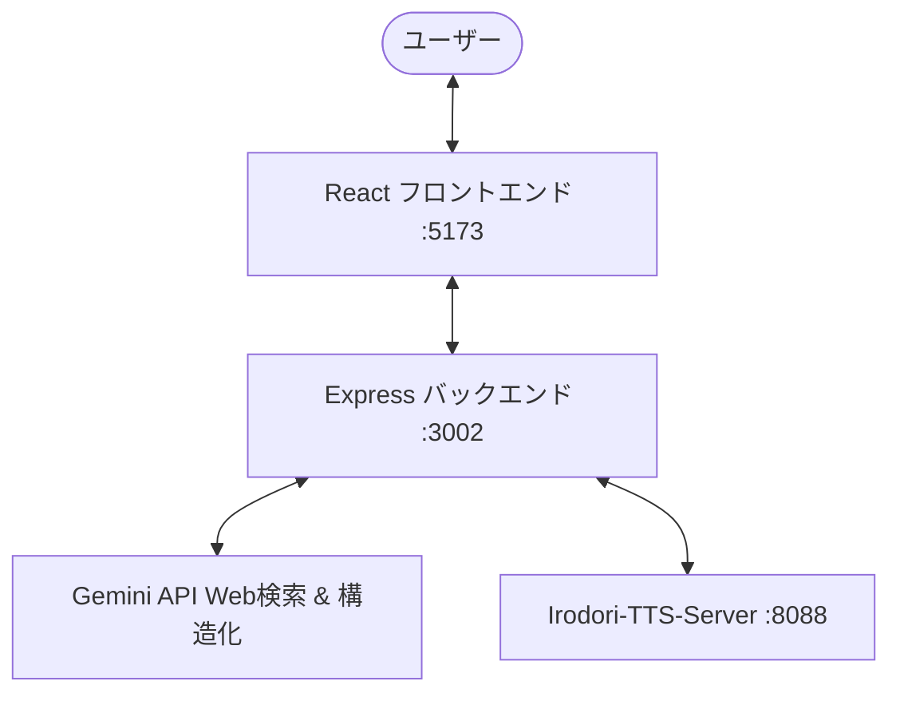

# Cross-Talk TTS

Gemini API で生成した2人のキャラクターによる対談討論台本を、ローカルで動作する `Irodori-TTS-Server` で音声化し、ADVゲーム風の画面でインテリジェントに順次再生するWebアプリケーションです。


[](https://youtu.be/bNOc2E-6tpc?si=wlmYSBRpQYx992gA)

---

## 🌟 特徴

1. **インテリジェント音声バッファリング再生制御**:
   - 音声合成（TTS）の生成速度を動的に予測しながら、最後まで途切れずに再生できる安全なタイミングを算出して自動再生を開始します。
   - 音声の生成速度が再生速度を下回り、次のセリフが間に合わない場合は自動的に「バッファリング中」として一時停止し、準備ができ次第スムーズに自動再開します。
2. **Web検索を交えた本格的な討論 (Gemini 2.5/3.5)**:
   - Gemini API の Google Search Grounding（Web検索）機能を有効化し、最新の事実やデータに基づいた客観的で説得力のある議論を自動生成します。
   - Gemini の「検索Grounding」と「JSON出力スキーマ」を同時に使用できない制約をクリアするため、バックエンド側で **「1: 台本テキストの検索生成」 → 「2: JSONスキーマへの構造化」の二段階呼び出し** を自動実行します。
3. **ADVゲーム風のダイナミックな演出**:
   - ネオンが光るハイテク討論スタジオをイメージしたダークテーマの背景デザイン。
   - 会話の進行と `emotion` (default/serious/angry) に連動して、キャラクター（クレアとカレン）の表情別立ち絵がスムーズに切り替わります。
   - 発言中のキャラクターは拡大かつ明るくハイライトされ、非発言者は自動で暗くなり後退するアニメーション演出。
   - 討論中に Gemini が使用した検索キーワードを画面上部にリアルタイム表示。
4. **堅牢な非同期処理 & 中断制御**:
   - 討論を途中で「終了」した際に、実行中の非同期フェッチリクエストや Audio ロードイベントをすべて安全に破棄するセッションID管理を導入。リリースの安全な解放と不要なリクエストの抑制を行います。
5. **TTSサーバーの接続エラーハンドリング**:
   - 起動時に自動で Irodori-TTS-Server への疎通確認を行い、起動していない場合はエラー画面と再試行ボタンを表示します。

---

## 🏗️ システム構成



- **フロントエンド**: React (Vite, TypeScript, Vanilla CSS) - `http://localhost:5173`
- **バックエンド**: Node.js (Express, TypeScript) - `http://localhost:3002`
- **音声合成サーバー**: Irodori-TTS-Server (OpenAI API互換) - `http://localhost:8088`

---

## 🛠️ セットアップと起動手順

### 1. 前提条件
- Node.js (v18 以上推奨) がインストールされていること。
- [Irodori-TTS-Server](https://github.com/Aratako/Irodori-TTS-Server) がローカル環境等で起動していること（デフォルト設定では `http://localhost:8088`）。

### 2. インストール
リポジトリのルートディレクトリで以下を実行して、共通依存関係およびフロントエンド・バックエンドのパッケージをインストールします：

```bash
# ルートのインストール
npm install

# バックエンドとフロントエンドの依存関係を一括インストール
cd backend && npm install && cd .. && cd frontend && npm install && cd ..
```
※ 手動で個別に行う場合は以下を実行してください：
```bash
# ルート
npm install
# バックエンド
cd backend && npm install && cd ..
# フロントエンド
cd frontend && npm install && cd ..
```

### 3. 環境変数の設定
`backend/` ディレクトリ配下に `.env` ファイルを作成し、Gemini API キー等の必要な情報を設定します（テンプレートとして `backend/.env.example` が利用可能です）。

```env
PORT=3002
GEMINI_API_KEY=あなたのGemini_APIキーを入力してください
TTS_SERVER_URL=http://localhost:8088

# Speaker 1 Configuration (クレア)
SPEAKER1_NAME=クレア
SPEAKER1_PROMPT=あなたは「クレア」です。論理的・データ重視ですが、口調は今どきの女子高生（JK）にしてください。データを引用しながらも、「〜だし」「それウチの調べだと違くない？」「〜ってこと」などのフランクなJK言葉を使う知的JKとして議論を展開してください。

# Speaker 2 Configuration (カレン)
SPEAKER2_NAME=カレン
SPEAKER2_PROMPT=あなたは「カレン」です。感情的・現場の代弁者で、元気いっぱいな女子高生（JK）です。「ヤバくない？」「絶対〜っしょ！」「〜じゃん！」などのギャル風・JK口調で、人々の感情や実際の生活の実情を代弁しながらパッション全開で熱く主張してください。
```

### 4. 開発サーバーの起動
ルートディレクトリで以下のコマンドを実行すると、`concurrently` によってバックエンドとフロントエンドが同時に起動します：

```bash
npm run dev
```

起動後、ブラウザで `http://localhost:5173/` にアクセスして利用を開始してください。

---

## 📝 ライセンス

[ISC License](LICENSE)
